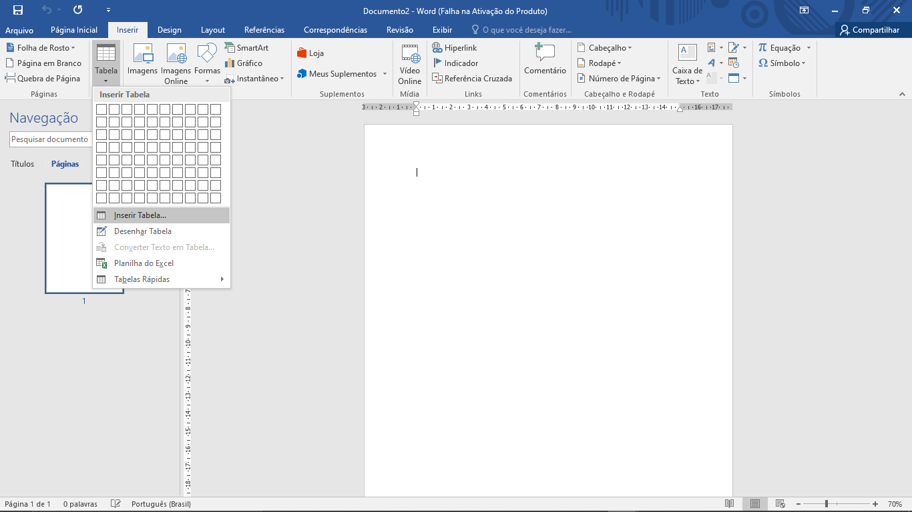
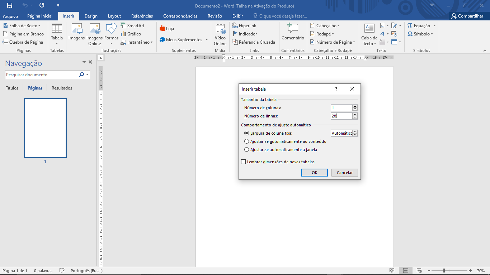
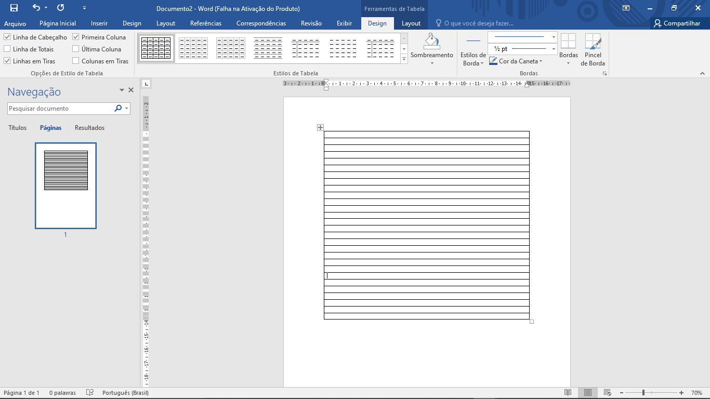
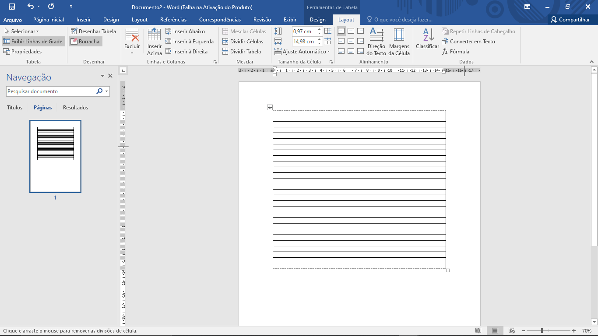
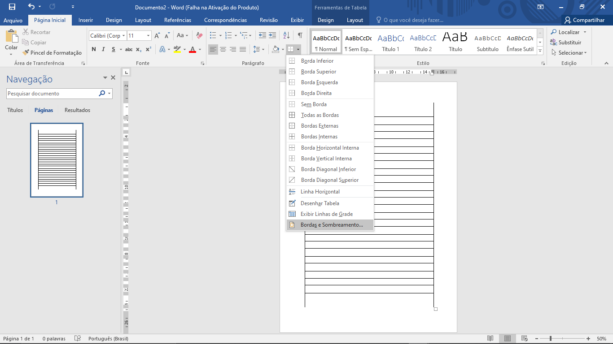
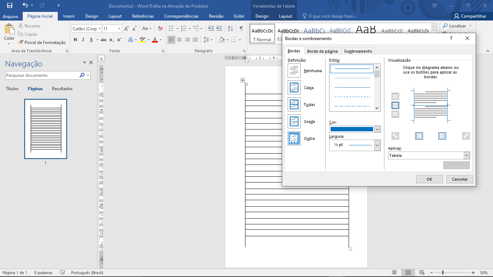
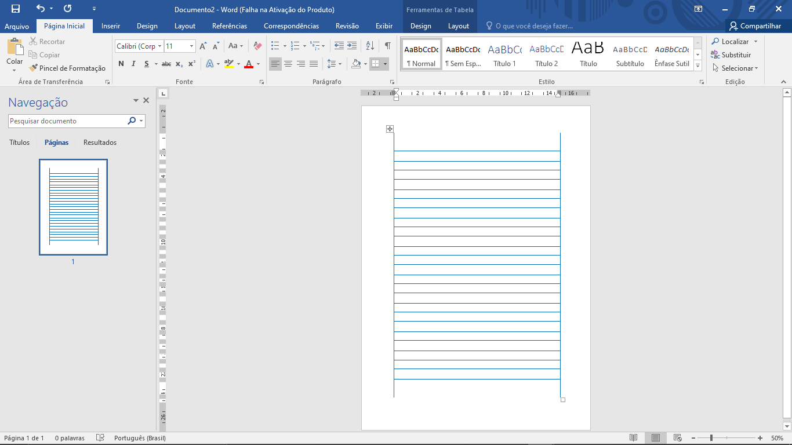

# 
 Folha de 25 linhas 

## Procedimento 👇

1. Abre o **Word**
2. Vai no menu **Inserir**
3. No separador **Tabela**, seleciona a opção **Inserir Tabela...**
4. Número de colunas: **1**
5. Número de linhas: **28**
6. Ok
7. Vai no menu *Layout*
8. No separador **Desenhar**, seleciona a **Borracha**
9. Elimina duas linhas no **top** da coluna
10. Elimina as duas última linhas da coluna
11. Preciona a última linha da coluna e **puxa a Tabela** até ao final da página 
12. Seleciona a **Tabela**
  - Bordas
  - Bordas e Sombreamento
  - Configura a cor que desejar para as linhas da tabela
  - Ok
13. Salva o documento

## Anexos

